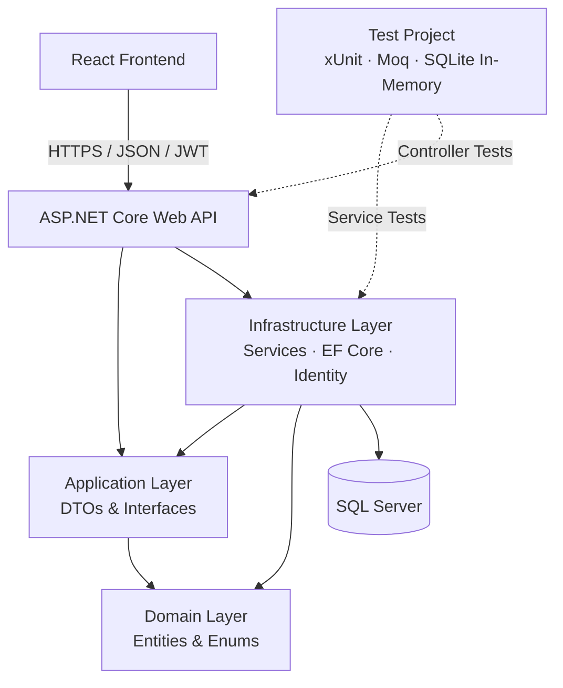

# IPL Merchandise Fan Store

A full-stack ecommerce assessment application for browsing and purchasing merchandise across IPL franchises.

**Tech Stack:** React · ASP.NET Core .NET 8 · Entity Framework Core · SQL Server · ASP.NET Core Identity · JWT · xUnit · Moq

**Automated Tests:** 49 passing ✅

> Demo application created for technical assessment purposes.  
> This project is not affiliated with or endorsed by IPL or its franchises.

---

## Application Preview


---

## Application Screenshots

### Product Search & Filtering


### Product Details & Jersey Size Selection


### Shopping Cart


### Authentication


### Order History


---

# Features

## Product Catalog

The storefront provides merchandise across 10 IPL franchises.

Supported product categories include:

- Jerseys
- Caps
- Flags
- Autographed merchandise

The catalog supports:

- Product pricing
- Inventory availability
- Product details
- Search by product name or description
- Filter by franchise
- Filter by product type
- Combined filtering
- Sorting
- Team-based navigation
- Responsive product cards

---

## Authentication

Authentication is implemented using ASP.NET Core Identity and JWT.

Supported functionality includes:

- User registration
- User login
- ASP.NET Core Identity password management
- JWT authentication
- Authenticated user context
- Protected frontend routes
- Protected backend APIs
- User-specific cart
- User-specific order history

The frontend route protection improves user experience, while authorization is enforced by the backend API.

---

## Shopping Cart

The shopping cart is persisted in SQL Server.

Users can:

- Add products
- Update quantities
- Remove products
- Clear the cart
- View product price and subtotal
- View current stock availability
- Select jersey sizes
- Maintain separate cart lines for different jersey sizes

Supported jersey sizes:

```text
M
L
XL
```

For example:

```text
CSK Jersey - M
CSK Jersey - XL
```

are stored as separate cart entries.

Cart line uniqueness is based on:

```text
CartId
+
ProductId
+
SelectedSize
```

This allows the same jersey in different sizes to exist independently in the cart.

---

## Checkout

Checkout is processed entirely on the server.

During checkout the API:

1. Reloads the authenticated user's cart
2. Revalidates product availability
3. Revalidates inventory
4. Creates an Order
5. Creates OrderItem snapshots
6. Calculates the order total
7. Reduces product inventory
8. Clears cart items
9. Commits the database transaction

The frontend does not determine the final checkout price.

The backend reads the current product price and persists it with the order.

---

## Order History

Authenticated users can view their previous orders.

Order History displays:

- Order number
- Order date
- Status
- Purchased merchandise
- Franchise
- Product type
- Selected jersey size
- Quantity
- Purchase-time unit price
- Order total

Users can only access their own orders.

---

## Recommendations

After successful checkout, the application displays merchandise recommendations.

Recommendations prioritize:

1. Products from the same franchise
2. Different product types from the purchased merchandise
3. Other available products

Already purchased products are excluded from the immediate recommendation set.

---

# Architecture

The application uses a layered architecture with separate projects for API, Application, Domain, Infrastructure, Tests, and React UI.



---

# Solution Structure

```text
IPL_Franchises
│
├── IPL_Franchises.API
│   ├── Controllers
│   ├── Middleware
│   └── Authentication configuration
│
├── IPL_Franchises.Application
│   ├── DTOs
│   ├── Interfaces
│   └── Application exceptions
│
├── IPL_Franchises.Domain
│   ├── Entities
│   └── Enums
│
├── IPL_Franchises.Infrastructure
│   ├── Data
│   ├── Identity
│   ├── Migrations
│   └── Services
│
├── IPL_Franchises.Tests
│   ├── Controllers
│   ├── Helpers
│   ├── Middleware
│   └── Services
│
├── ipl-franchises-ui
│   ├── public
│   └── src
│       ├── api
│       ├── components
│       ├── context
│       ├── pages
│       ├── styles
│       └── utils
│
├── docs
│   └── screenshots
│
├── IPL_Franchises.slnx
└── README.md
```

---

# Technology Stack

## Frontend

```text
React
React Router
JavaScript
CSS
Vite
Lucide React
```

## Backend

```text
ASP.NET Core Web API
.NET 8
C#
Entity Framework Core
ASP.NET Core Identity
JWT Authentication
```

## Database

```text
SQL Server
EF Core Migrations
```

## Testing

```text
xUnit
Moq
SQLite In-Memory
AAA Pattern
```

---

# Database Design

The application persists data using SQL Server.

Important tables include:

```text
AspNetUsers
AspNetRoles
Franchises
Products
Carts
CartItems
Orders
OrderItems
```

## Main Relationships

```text
Franchise
    |
    └── Products


User
    |
    └── Cart
          |
          └── CartItems
                |
                └── Product


User
    |
    └── Orders
          |
          └── OrderItems
```

---

# Authentication & Security

ASP.NET Core Identity is used for account management.

JWT tokens are issued after successful registration or login.

Protected API endpoints use:

```csharp
[Authorize]
```

The authenticated user ID is obtained from:

```csharp
ClaimTypes.NameIdentifier
```

Cart and order APIs do not accept a user ID from the React client.

Instead:

```text
JWT
 ↓
Authenticated Claims
 ↓
NameIdentifier
 ↓
User-specific Cart / Orders
```

This prevents one client from requesting another user's cart or order history simply by changing a user ID.

JWT signing secrets are not stored in the source repository.

Sensitive configuration should be provided using secure configuration such as .NET User Secrets or environment variables.

---

# API Endpoints

## Authentication

```http
POST /api/auth/register
POST /api/auth/login
GET  /api/auth/me
```

---

## Products

```http
GET /api/products
GET /api/products/{id}
```

Examples:

```http
GET /api/products?Franchise=CSK

GET /api/products?Type=Jersey

GET /api/products?Search=jersey

GET /api/products?Franchise=RR&Type=Flag
```

Filters can be combined.

---

## Cart

Authentication required.

```http
GET    /api/cart
POST   /api/cart/items
PUT    /api/cart/items/{cartItemId}?quantity=2
DELETE /api/cart/items/{cartItemId}
```

Example add-to-cart request:

```json
{
  "productId": 1,
  "quantity": 1,
  "selectedSize": "XL"
}
```

For products other than jerseys, `selectedSize` can be null.

---

## Orders

Authentication required.

```http
POST /api/orders/checkout
GET  /api/orders
GET  /api/orders/{orderId}
```

---

# Order Snapshot Design

`OrderItem` stores purchase-time values including:

```text
ProductId
ProductName
FranchiseCode
ProductType
SelectedSize
UnitPrice
Quantity
```

This is intentional.

If the original product name or price changes later, historical orders should still show the information that existed when the customer placed the order.

---

# Inventory Handling

Inventory is validated when a product is added or updated in the cart.

More importantly, inventory is validated again during checkout.

Example:

```text
Available Stock = 2
Cart Quantity   = 3

Checkout
    ↓
Stock validation fails
    ↓
Order is not created
    ↓
Inventory remains unchanged
    ↓
Cart remains intact
```

Inventory is reduced only after checkout validation succeeds.

---

# Error Handling

The API includes centralized exception handling middleware.

Business validation errors are returned as:

```text
HTTP 400 Bad Request
```

Unexpected exceptions return:

```text
HTTP 500 Internal Server Error
```

Unexpected internal exception details are not exposed to the frontend.

---

# Testing

The backend currently contains:

```text
49 automated tests
0 failures
```

Tests follow the AAA pattern:

```text
Arrange
Act
Assert
```

---

## Service Testing Strategy

Service tests use a SQLite in-memory relational database.

SQLite was preferred over mocking EF Core `DbSet` objects because the service layer contains database-oriented business logic and relational behavior.

This provides:

- Fast isolated tests
- Real EF Core query execution
- Relational constraints
- Database indexes
- Navigation properties
- More realistic persistence behavior

---

## Cart Service Tests

Covered scenarios include:

- Empty cart
- Add product
- Positive quantity validation
- Jersey size validation
- Jersey size normalization
- Same product + same size merges quantity
- Same product + different size creates separate lines
- Stock validation
- Quantity update
- Cart item removal

---

## Order Service Tests

Covered scenarios include:

- Successful checkout
- Empty cart validation
- Inactive products
- Insufficient stock
- Order creation
- OrderItem snapshot creation
- Total calculation
- Inventory reduction
- Cart clearing
- User-specific order history
- Preventing access to another user's order

---

## Product Service Tests

Covered scenarios include:

- Product search
- Description search
- Case-insensitive search behavior
- Franchise filtering
- Product type filtering
- Combined filters
- Active-product filtering
- Empty result handling
- Pagination
- Page-size limits
- Product-by-ID retrieval

---

## Controller Tests

Moq is used for controller unit tests.

The controller layer is isolated from service implementations by mocking:

```text
IProductService
ICartService
IOrderService
```

Controller tests verify:

- HTTP result types
- Service calls
- User claims
- Unauthorized responses
- NotFound responses
- Successful responses

---

## Middleware Tests

Middleware tests verify:

```text
BusinessException
        ↓
HTTP 400
        ↓
Business message returned
```

and:

```text
Unexpected Exception
        ↓
HTTP 500
        ↓
Sanitized error response
```

---

# Running the Project

## Prerequisites

Install:

```text
.NET 8 SDK
SQL Server / SQL Server LocalDB
Node.js
npm
```

Optional:

```text
SQL Server Management Studio
Visual Studio 2022
VS Code
```

---

# Backend Setup

From the repository root:

```powershell
dotnet restore
```

Build the solution:

```powershell
dotnet build
```

---

## Database

The application uses Entity Framework Core migrations.

Apply migrations with:

```powershell
dotnet ef database update `
  --project .\IPL_Franchises.Infrastructure `
  --startup-project .\IPL_Franchises.API
```

If the EF CLI tool is not installed:

```powershell
dotnet tool install --global dotnet-ef
```

---

## JWT Configuration

JWT signing secrets should be configured using secure configuration.

For local development, .NET User Secrets can be used.

Do not commit JWT secrets to source control.

---

## Run the API

```powershell
dotnet run --project .\IPL_Franchises.API
```

Local API URL:

```text
https://localhost:7096
```

API base URL:

```text
https://localhost:7096/api
```

---

# Frontend Setup

Navigate to:

```powershell
cd .\ipl-franchises-ui
```

Install dependencies:

```powershell
npm install
```

Create:

```text
.env
```

with:

```env
VITE_API_BASE_URL=https://localhost:7096/api
```

The `.env` file is intentionally excluded from source control.

Run the React application:

```powershell
npm run dev
```

---

# Running Automated Tests

From the solution root:

```powershell
dotnet test .\IPL_Franchises.Tests\IPL_Franchises.Tests.csproj
```

Expected result:

```text
Passed: 49
Failed: 0
```

---

# Frontend Production Build

From:

```text
ipl-franchises-ui
```

run:

```powershell
npm run build
```

---

# Key Design Decisions

## Server-Side Pricing

Product prices are not trusted from the browser during checkout.

The backend reads the product price from the database and uses it when creating the order.

---

## Server-Side User Identity

Cart and order ownership is derived from the JWT identity.

The frontend does not submit an arbitrary user ID for protected operations.

---

## OrderItem Snapshots

Order items preserve purchase-time product metadata.

This prevents historical orders from changing if the product catalog is modified later.

---

## Inventory Revalidation

Stock is checked again during checkout.

This prevents the application from relying on potentially stale cart information.

---

## Jersey Size Handling

The current assessment supports:

```text
M
L
XL
```

Jersey size is part of the cart-line identity so different sizes of the same product remain separate.

---

## Static Product Images

For this assessment, merchandise images are stored as static React assets and mapped using franchise and product type.

For a production system, image URLs would normally be persisted with product information and served through object storage and a CDN.

---

## Testing EF Core

EF Core `DbSet` objects are not mocked for service-level persistence tests.

SQLite in-memory is used instead so relational behavior is exercised while tests remain fast and isolated.

---

# Future Enhancements

Possible production enhancements include:

- Payment gateway integration
- Payment status tracking
- Admin inventory management
- Product administration
- Cloud object storage for images
- CDN integration
- Email order confirmation
- Refresh tokens
- Rate limiting
- Structured logging
- Distributed tracing
- Redis caching
- Optimistic concurrency for inventory
- Docker support
- CI/CD pipeline
- Cloud deployment
- Product reviews
- Wishlist persistence
- Returns/refunds workflow

These features are intentionally outside the current assessment scope.

---

# Assessment Focus

The project demonstrates:

```text
Full-stack application development
React UI development
ASP.NET Core Web API development
Layered architecture
REST API design
Entity Framework Core
SQL Server persistence
Authentication and authorization
JWT security
Shopping cart design
Transactional checkout
Inventory validation
Order history
Unit testing
AAA testing pattern
Moq
Relational service testing
Error handling
Responsive ecommerce UI
```

---

# Disclaimer

This project was created for technical assessment and demonstration purposes.

It is not affiliated with, sponsored by, or endorsed by IPL or any IPL franchise.